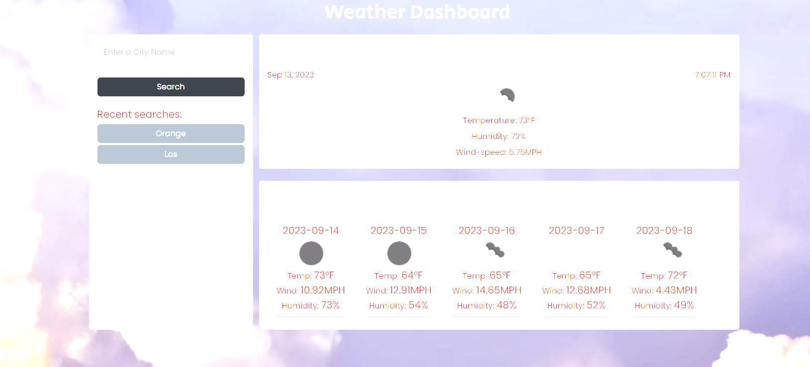

# Weather Dashboard

Module 6: Server-Side APIs Challenge

## Proejct Description

- When user searches for a city at the weather dashboard inputs, user will be presented with current city weather
- When user views the current weather, user will see the city name, the date, an icon representation of weather conditions, the temperature, the humidity, and the the wind speed
- When user searched a city, the city is added to the search history
- When user views future weather conditions for that city, user will be presented with a 5-day forecast
- When user clicks on a city in the search history, then user will see the current and future conditions for that city again

## Screenshots demo

![Screenshots]

## 🛠 Skills
HTML, CSS, Javascript

## 3rd Party APIs
- JQuery
- dayJS 
- Bootstrap 
- google fonts

## Deployment

[Click here for the deployed application] https://github.com/Robertng2503/Hom6

